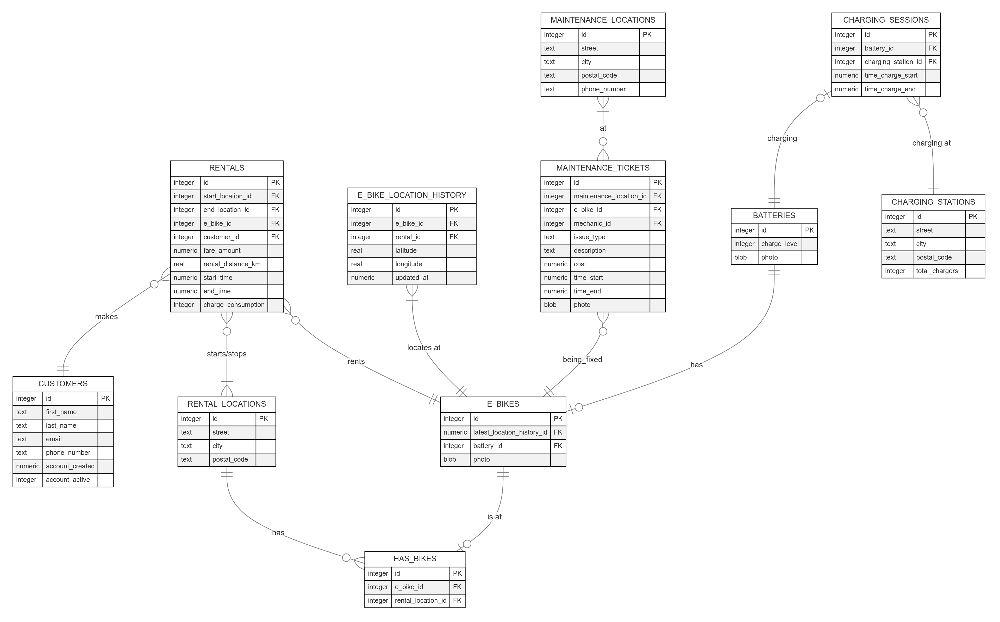

# Design Document

By Dave von Deschwanden
SQLITE DATABASE

## Scope

This database is created for an electronic-bike rental service. Users are able to find locations of rental spots across a city, rent a bike for a period of time and drop it off at another location. E-bikes are equipped with batteries, and their charge levels are displayed to potential renters.
Bikes may be maintenanced in specific repair locations should problems arise. Batteries need to be recharged when they are low; this is done at specific recharge stations.

The scope therefore is:

* **Customers** - Users who rent e-bikes, with associated identifying information.
* **Rentals** - Information identifying the users, which bike they are renting, where from, where to, for how long and how far.
* **E-Bikes** - Details on each e-bike, including its current location; either at a rental station or its last known GPS coordinates
* **Has-Bikes** - A Bridge table identying which e-bikes are currently at which rental locations.
* **E-Bike Location History** - Details the location of a bike as per a rental. Keep real-time gps information here will keep the e-bike and rentals tables lighter. After much deliberation, despite adding multiple rows of data, it seems logical to prevent against theft.
* **Batteries** - Identifying the battery, it's current charge amount
* **Maintenance Tickets** - A maintenance ticket identifying the e-bike, the problem, when and for how long it is being repaired for, and where.
* **Maintenance Locations** - The locations where bikes are maintenanced.
* **Charging Session** - Tables identifying if a battery is being charged; when and where.
* **Charge Locations** - The locations where batteries are charged.

More granular operational roles such as bike redistribution workers, maintenance staff, and administrative users are excluded from this database design to focus on core rental operations.
While the core tables—Customers, Rentals, Rental Locations, and E-Bike—capture the essential functionality, additional tables were included as a glimpse/thought experiment to explore other considerations for a system like this.

## Functional Requirements

This database will support:

* CRUD operations for customers renting e-bikes
* Tracking e-bikes, rentals, user information, stationary locations.
* Keeping a GPS record of e-bikes.

With this iteration, there is only user support. The system will support operational roles in subsequent iterations.

## Representation

Entities are captured in SQLite tables with the following schema.

### Entities

The database includes the following entities:

#### Customers

The `customers` table includes:

* `id`, which specifies the unique ID for the customer as an `INTEGER`. This column thus has the `PRIMARY KEY` constraint applied.
* `first_name`, which specifies the customer's first name as `TEXT`, given `TEXT` is appropriate for name fields.
* `last_name`, which specifies the customer's last name. `TEXT` is used for the same reason
* `email`, which specifies the customer's email. `TEXT` is appropriate for email fields. A `UNIQUE` constraint ensure that no two customers have the same email.
* `phone_number`, which specifies the customer's phone number. `TEXT` is appropriate for phone fields. A `UNIQUE` constraint ensure that no two customers have the same phone number.
* `account_created` which specifies a datetime when the account was created as a `NUMERIC`. A `NOT NULL` constraint ensure it is filled out and a `DEFAULT` of `CURRENT_TIMESTAMP` at row insertion.
* `account_active`, specifies if this customer's account is still active. It is technically a `BOOL` type, represented here as either a `0` for `FALSE` and `1` for `TRUE`. It is assumed that their account is active so the `DEFAULT` is set to `1`.

All columns in the `customers` table are required and hence should have the `NOT NULL` constraint applied. No other constraints are necessary.

#### Rentals

The `rentals` table includes:

* `id`, which specifies the unique ID for the rental as an `INTEGER`. This column thus has the `PRIMARY KEY` constraint applied.
* `start_location_id`, which is the ID of the ending rental location as an `INTEGER`. This column thus has the `FOREIGN KEY` constraint applied, referencing the `id` column in the `rental_location` table to ensure data integrity. There is a `NOT NULL` constraint because a rental starts somewhere.
* `end_location_id`, which is the ID of the starting rental location as an `INTEGER`. This column thus has the `FOREIGN KEY` constraint applied, referencing the `id` column in the `rental_location` table to ensure data integrity. There is no `NOT NULL` constraint because at row creation, the system will not know where the bike will be dropped off.
* `e_bike_id`, which is the ID of the e-bike being rented as an `INTEGER`. This column thus has the `FOREIGN KEY` constraint applied, referencing the `id` column in the `e_bike` table to ensure data integrity.
* `customer_id`, which is the ID of the customer who made the rental as an `INTEGER`. This column thus has the `FOREIGN KEY` constraint applied, referencing the `id` column in the `customers` table to ensure data integrity.
* `fare_amount`, the decimal amount representing the cost paid by the customer as a `NUMERIC`. This is ideal for avoiding rounding errors with `REAL` types. The `CHECK` constraint ensures that no negative amount is charged for the fare. There is no `NOT NULL` because we do not know the final fare at row creation.
* `rental_distance_km`, the distance in kilometers travelled for that rental as a `REAL`. There is no `NOT NULL` because we do not know the final distance at row creation.
* `start_time`, the datetime the rental started as a `NUMERIC`. A `NOT NULL` constraint is applied as well as a `DEFAULT` of `CURRENT_TIMESTAMP` at row insertion.
* `end_time`, the datetime the rental ended as a `NUMERIC`. No `NOT NULL` constraint is applied because we do not know when the rental ends at row creation.
* `charge_consumption`, the amount of battery consumed as an `INTEGER`. No `NOT NULL` constraint is applied because we do not know when the total charge consumption at row creation.

#### Rental Location

The `rental_locations` table includes:

* `id`, which specifies the unique ID for the e-bike as an `INTEGER`. This column thus has the `PRIMARY KEY` constraint applied.
* `street`, which specifies the street name of the rental location as `TEXT`.
* `city`, which specifies the city name of the rental location as `TEXT`.
* `postal_code` which specifies the postal code of the rental location as `TEXT`.

#### Has-Bikes
* `id`, which specifies the unique ID for the row as an `INTEGER`. This column thus has the `PRIMARY KEY` constraint applied.
* `e_bike_id`, which is the ID of the e-bike as an `INTEGER`. This column thus has the `FOREIGN KEY` constraint applied, referencing the `id` column in the `e_bike` table to ensure data integrity.
* `rental_location_id`, which is the ID of the rental location as an `INTEGER`. This column thus has the `FOREIGN KEY` constraint applied, referencing the `id` column in the `rental_location` table to ensure data integrity.

This table was added for normalization and optimization:
* Originally, the E-Bike table held the current_rental_location, which didn't make sense if it was rented on the road or in repairs. This table also helps with faster queries/lookups to find specific bikes and also gauge the rental locations; what is the city distribution looking like? do some areas have no bicycles? etc...
* Since the pertitent information for bike data is kept in the e_bike_location_history, when the status `currently_rented` turns to `1` / `TRUE`, then the row with `e_bike_id` in this table will be deleted, freeing up space and resources in the database.

#### E-Bikes

The `e_bikes` table includes:

* `id`, which specifies the unique ID for the e-bike as an `INTEGER`. This column thus has the `PRIMARY KEY` constraint applied.
* `battery_id`, which is the ID of the battery currently being used in the e-bike as an `INTEGER`. This column thus has the `FOREIGN KEY` constraint applied, referencing the `id` column in the `battery` table to ensure data integrity.
* `latest_location_history_id`, which is the ID of the last known location recorded in the e-bikes location history as an `INTEGER`. This column thus has the `FOREIGN KEY` constraint applied, referencing the `id` column in the `e_bike_location_history` table to ensure data integrity. This is to apply a layer of redundancy against any form of theft of confusion of the e-bikes whereabouts.
<!-- * `currently_rented`, specifies if the e-bike is currently being rented. It is technically a `BOOL` type, represented here as either a `0` for `FALSE` and `1` for `TRUE`. There is a `NOT NULL` constraint.  -->
<!-- This was redundant and led to inconsistency with my tables, I made a view instead (rental record exists, but there is no end date yet; ie still ongoing) -->
* `photo`, which will be a photo of the battery, that will be best stored as a `BLOB`.

#### Location History

The `e_bike_location_history` table includes:

* `id`, which specifies the unique ID for the e-bike location history as an `INTEGER`. This column thus has the `PRIMARY KEY` constraint applied.
* `e_bike_id`, which is the ID of the e-bike whose location is being monitered as an `INTEGER`. This column thus has the `FOREIGN KEY` constraint applied, referencing the `id` column in the `e_bike` table to ensure data integrity.
* `rental_id`, which is the ID of the rental record as an `INTEGER`. This column thus has the `FOREIGN KEY` constraint applied, referencing the `id` column in the `e_bike` table to ensure data integrity. This attribute will help with quicker querying of location data for any given rental.
* `latitude`, the latitudal value of an e-bike's location at a given time as a `REAL`. To allow calculation of ranges for GPS location, `REAL` is a more ideal choice.
* `longitude`, the longitudal value of an e-bike's location at a given time as a `REAL`. For the same benefits of computing ranges and values as above, `REAL` is the most suitable choice.
* `updated_at`, which is a datetime of when this row was inserted to give an e-bike's position. A `NUMERIC` is the appropriate choice. These updates are recorded at a reasonable interval to make sure that the database is not being overloaded with constant writes. A `DEFAULT` of `CURRENT_TIMESTAMP` at row insertion is specified.

#### Battery

The `battery` table includes:

* `id`, which specifies the unique ID for the battery as an `INTEGER`. This column thus has the `PRIMARY KEY` constraint applied.
* `charge_level`, which displays the current amount of charge as an `INTEGER`. This field
<!-- * `currently_charging`: This also proved redundant as we removed for a view instead. -->
* `photo`, which will be a photo of the battery, that will be best stored as a `BLOB`.

#### Maintenance Ticket

The `maintenance_ticket` table includes:

* `id`, which specifies the unique ID for the maintenance as an `INTEGER`. This column thus has the `PRIMARY KEY` constraint applied.
* `maintenance_location_id`,
* `e_bike_id`, which is the ID of the e-bike that is being maintained as an `INTEGER`. This column thus has the `FOREIGN KEY` constraint applied, referencing the `id` column in the `e_bike` table to ensure data integrity.
* `mechanic_id`, which is the ID of the mechanic that is doing the maintainance as an `INTEGER`. This column thus has the `FOREIGN KEY` constraint applied, referencing the `id` column in the `mechanic` table to ensure data integrity.
* `issue_type`, which specifies the category under which the repair may be labelled as as a `TEXT`. There is a `CHECK` constraint which will make sure that it will be within one of the enumerable types (frame, wheel, electronic, brakes, lights, or misc). A `NOT NULL` constraint is applied to describe what kind of problem the e-bike is being repaired for.
* `description`, which allows the mechanic to add more detail in regards to the repairs made as `TEXT`.
* `cost`, the decimal amount representing cost of repairs as a `NUMERIC`. This is ideal for avoiding rounding errors with `REAL` types. The `CHECK` constraint ensures that no negative amount is charged for the fare.
* `time_start`, the datetime the maintenance started as a `NUMERIC`. A `NOT NULL` constraint is applied to verify that the bike is in repairs. A `DEFAULT` of `CURRENT_TIMESTAMP` at row insertion is also specified.
* `time_end`, the datetime the maintenance ended as a `NUMERIC`.
* `photo`, which will be a photo of the repair / broken item, that will be best stored as a `BLOB`.

 The absence `NOT NULL` for the `cost`, `description` and `time_end` columns is to faciliate the update / insertion of new data that will come as repairs progress and eventually end.

#### Maintenance Locations

The `maintenance_location` table includes:

* `id`, which specifies the unique ID for the maintenance location as an `INTEGER`. This column thus has the `PRIMARY KEY` constraint applied.
* `street`, which specifies the street name of the maintenance location as `TEXT`.
* `city`, which specifies the city name of the maintenance location as `TEXT`.
* `postal_code`, which specifies the postal code of the maintenance location as `TEXT`.
* `phone_number`, which specifies the maintenance location's phone number. `TEXT` is appropriate for phone fields. A `UNIQUE` constraint ensure that no two maintenance locations have the same phone number.

#### Charging Session

The `charging_sessions` table includes:

* `id`, which specifies the unique ID for the charging session as an `INTEGER`. This column thus has the `PRIMARY KEY` constraint applied.
* `battery_id`, which is the ID of the battery currently currently in the charging session as an `INTEGER`. This column thus has the `FOREIGN KEY` constraint applied, referencing the `id` column in the `battery` table to ensure data integrity.
* `charging_station_id`, which is the ID of the charging station the battery is currently charging at as an `INTEGER`. This column thus has the `FOREIGN KEY` constraint applied, referencing the `id` column in the `charging_station` table to ensure data integrity.
* `time_charge_start`, the datetime of when the charging started as a `NUMERIC`. A `NOT NULL` constraint is applied as well as a `DEFAULT` of `CURRENT_TIMESTAMP` at row insertion.
* `time_charge_end`, the datetime of when the charging ended as a `NUMERIC`.

#### Charge Locations

The `charging_station` table includes:

* `id`, which specifies the unique ID for the charging station as an `INTEGER`. This column thus has the `PRIMARY KEY` constraint applied.
* `street`, which specifies the street name of the charging station as `TEXT`.
* `city`, which specifies the city name of the charging station as `TEXT`.
* `postal_code` which specifies the postal code of the charging station as `TEXT`.
* `total_chargers`, which specifies the total amount of chargers that location can facilitate as an `INTEGER`. A `NOT NULL` constraint is also applied.

Overall, the `NOT NULL` constraint was applied to ensure all columns are filled out properly. Any columns missing these constraints have been allowed to do so to avoid errors at insertion and facilitate later-time row updates.

### Relationships

The below entity relationship diagram describes the relationships among the entities in the database.

As detailed by the diagrams:
* **RENTALS/CUSTOMERS** - A customer may make 0 or many rentals. A rental may only be associated with 1 and only 1 customer.
* **RENTALS/E-BIKE** - An rental must have 1 and only 1 e-bike associated with it. An e-bike can have 0 rentals, but may have been rented many times.
* **RENTAL_LOCATION/HAS_BIKE** - A rental location may have 0 e-bikes, or many e-bikes. A row in has_bikes means that 1 bike can only be associated with on rental location.
* **E-BIKE/HAS_BIKE** - An e-bike can have 0 rows in the has_bikes, but any row associated in that table must have 1 and only 1 bike associated with it.
* **E_BIKE_LOCATION_HISTORY/E-BIKE** - A e-bike's location history must an e-bike associated with it and only 1 e-bike. An e-bike can must have at least 1 location, but may/will have many.
* **RENTAL/RENTAL_LOCATION** - A rental must start/stop at at least 1 location and can end at many different locations. A rental location can have 0 rentals or many rentals.
* **MAINTENANCE_LOCATION/MAINTENANCE** - A maintenance location may have 0 tickets associated with it or may have many. Any ticket must have at least 1 location associated with it or many.
* **MAINTENANCE_TICKET/E-BIKE** - An e-bike can have 0 tickets, or many associated with it. A single maintenance ticket can have 1 and only 1 e-bike associated with it.
* **CHARGING_SESSONS/BATTERY** - A charging session can have 1 and only 1 battery, while a battery may not have any sessions, it can only have maximum 1 at a time.
* **BATTERY/E-BIKE** - A battery may have be in no bikes, but it can only ever be in 1 at 1 time. An e-bike must have a battery in it, and can only ever have 1 at a time.
* **CHARGING_SESSONS/CHARGING_STATION** - A charging session must be associated with 1 and only 1 charging station. A charging station may have no sessions associated with it, but it can have many.

## Optimizations

TODO:~~~~!!!!!!!!!!!!!!!!!!!!!!!!!!!!!!!!!!!!!!!!!!!!!!!!!!!!!!!!!!!!

In this section you should answer the following questions:

* Which optimizations (e.g., indexes, views) did you create? Why?

## Limitations

The current schema omits operational roles and will need to add these. For instance, mechanics involved with repairs are currently uncounted for; there will need to be a mechanics table that tracks these employees and links up to the maintenance_tickets table.

There is also no invoicing/payment system that will track customer transactions. Future iterations of the schema may link a payments table with the  customers and rental tables.

Lastly, the current schema is currently designed for one location only. Expansion to multiple cities/countries would require additional columns to be added.

